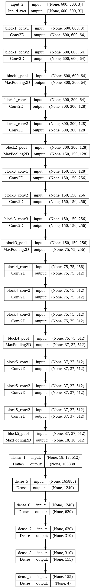
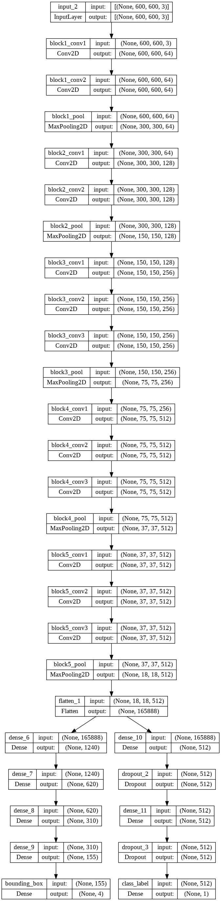
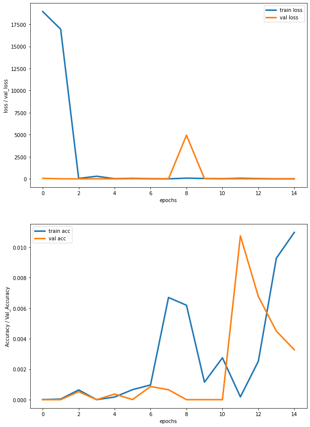
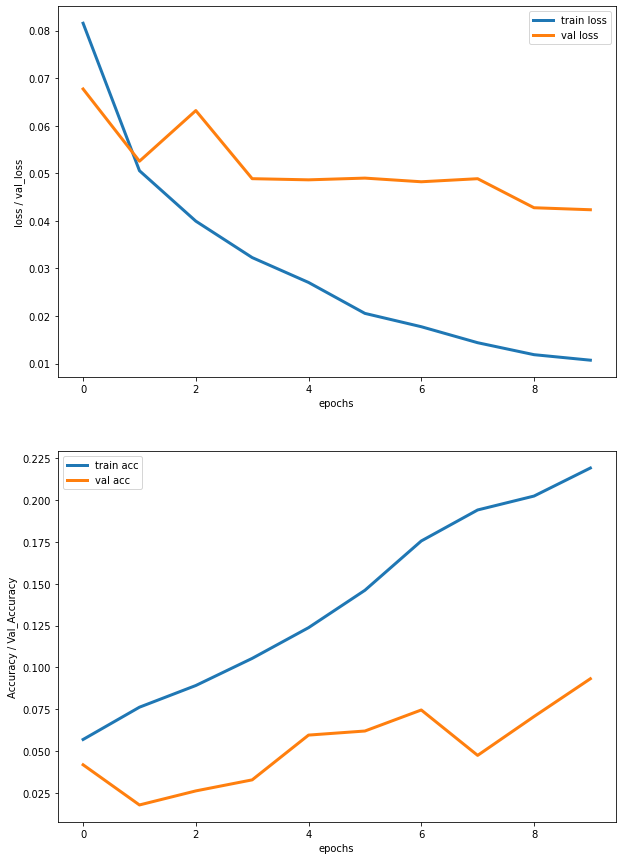
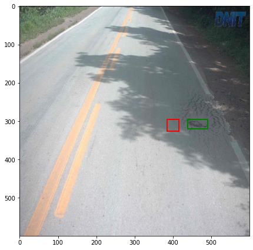
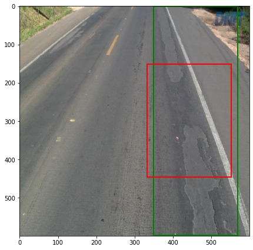
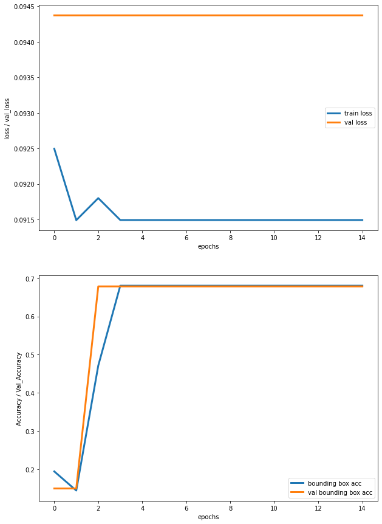
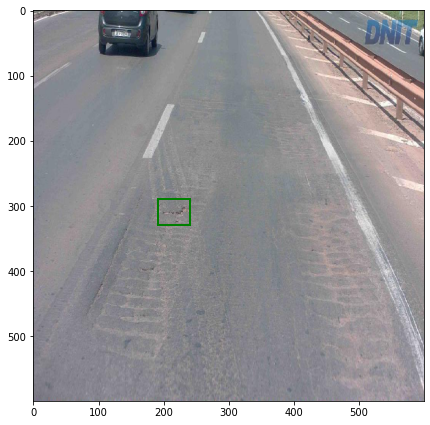

# ML-Group-Project-8: Pothole Detection on the Jetson Nano

## Introduction
With the new era of autonomous vehicles, there is an ever growing necessity for autonomous road safety and road defect detection. Our objective in this project is to develop machine learning models which detect potholes in roads, a small step towards making autonomous driving safer. The data we are currently planning to use comes from the Brazilian National Department of Transport Infrastructure, and consists of 2235 images of highways in the states of Espírito Santo, Rio Grande do Sul and the Federal District from 2014 to 2017. The resolution of the images is at least 1280x729 with a 16:9 aspect ratio. We hope to train deep convolutional neural networks and potentially other machine learning models to consistently identify potholes in new road images, with the end-goal of real time video inference using a Jetson Nano. We will also consider many data preprocessing methods such as image masking/transforming and scaling in our pipeline to further optimize our models. Our hypothesis is that a sufficiently large deep convolutional neural network is capable of accurately classifying road defects, and we hope to optimize its performance with what we have learned in class and previous work in the field.

## Methods

### Data Creation
The first step is to create the dataset with the images, their labels, and the parameters for the pothole bounding boxes. We will use keras to load and convert images to numpy arrays, and cv2 to detect the potholes and label them. We store the dataset as a csv file. This is what a sample/mask looks like with its corresponding bounding box

After creating the csv dataset, it looks like this:

### Data Exploration
We are working with a dataset that contains **2235** samples (images). The target classes are **0** and **1**, which correspond to the given road containing a pothole (**1**) or not (**0**). As we can see in the target class distribution, the data is a bit imbalanced. We have **564** samples with potholes, and **1671** samples without. 

What each of the target classes look like:
 

The distributions of bounding box widths & heights are very right skewed, as one would expect. 

### Data Preprocessing

* Our dataset consists of 2236 pairs of images. Each image is either 630 by 1024 or 640 by 1024.
In order to standardize, we scale each image down to 600 by 600. This also makes the training easier by decreasing the dimensions we input into our model [1].
* Once the image is loaded into our python environment as a PIL object, we convert to grayscale. This is actually only needed for the original images as they are in color and the pothole masks are already black and white.
* We then normalize the image by turning it into a numpy array and dividing by 255.
* Our result is 2236 image pairs all of which are (600, 600) numpy arrays with float values ranging from 0 to 1.

[1] The main reason is that as long as the rescaling doesn't significantly distort the relevant features of an image, shrinking it down allows us to build a deeper model and train on more examples with the limited compute and time resources we have. We will test it out but most likely we are going to end up shrinking the images even further (to 250 by 250) later on.

### [Model 1: Simple Model](https://github.com/sachinmloecher/ML-Group-Project-8/blob/a62a11a8ea079dfd9bda19a104655bb40fb89d5c/Simple_Model.ipynb)

Our first model is a Convolutional Neural Network with the layers:
 

This simple model has **4** convolutional layers and **1** Dense layer with 62 nodes. We used 15 epochs, with a batch size of 2, the Adam optimizer with a learning rate of **0.0001**, and $MSE$ as the loss function. This model has 5 outputs: the bounding box coordinates as well as the class.

### [Model 2: YOLO Model](https://github.com/sachinmloecher/ML-Group-Project-8/blob/a62a11a8ea079dfd9bda19a104655bb40fb89d5c/Yolo_Model.ipynb)

Our second model is similar to the original yolo v1 object detection CNN, with the layers:
 

This model has **20** convolutional layers and **5** Dense layers, with Batch Normalization and Leaky ReLu like in the original yolo v1 paper. We used 15 epochs, with a batch size of 2, and the Adam optimizer with a learning rate of **0.001**. We decided to make this model a regression only model, meaning it only outputs the bounding box predictions and not the class.

### Model 3: [VGG16 Model](https://github.com/sachinmloecher/ML-Group-Project-8/blob/a62a11a8ea079dfd9bda19a104655bb40fb89d5c/VGG16_Model.ipynb)

Our third model extends an already existing network with set initial weights. We altered the VGG16 Network Head with our own trainable Dense layers to output the predicted bounding box coordinates:

This model has **13** convolutional layers and **4** Dense layers, with Max Pooling in between layers. We used 10 epochs, with a batch size of 2, and the Adam optimizer with a learning rate of **0.0001*. This model is also a regression only model, meaning it has 4 outputs corresponding to the bounding box coordinate predictions.

### Model 4: Branched VGG16 

Our fourth model is a work in progress. It is similar to model 3, as it extends an existing network with set initial weights. We altered the VGG16 Network Head with two of our own trainable Dense layers to output the predicted bounding box coordinated and the predicticted class labels.

This model has **13** convolutional layers and **4** Dense layers for each branch, with Max Pooling in between layers. We used 15 epochs, with a batch size of 2, and the Adam optimizer with a learning rate of **0.0001*. This model has 5 outputs, corresponding to the 4 bounding box coordinate predictions and the binary pothole classification.

## Results

We are using IOU as an accuracy metric for the bounding boxes. Intersection over Union (IOU) is defined as the area of overlap divided by the area of union of the predicted and true bounding boxes. Typically, an IOU > 0.5 is very good.

### Model 1: Simple Model
This is how this simple model performed:
 

As we can see, this model is far too simple to have an IOU (accuracy in the graph) of **0.015** or higher. We can see signs of overfitting very early on.
We can see this simple model did not perform very well, but there is lots of room for improvement. Here are 2 example predictions (green: true, red:prediction):
 

 

### Model 2: YOLO Model
This is how the Yolo model performed:
 

As we can see, this model also did not perform very well, resulting in an test IOU similar to that of the simple model.

### Model 3: VGG16 Model
This is how the VGG16 model performed:
 

As we can see, this model did significantly better than the others, resulting in a training IOU of 21% and a testing IOU of almost 10%. Although there is still lots of room for improvement, this is a good start. Here are 2 example predictions made by the VGG16 model:

 

### Model 4: Branched VGG16 Model
This is how the Branched VGG16 model performed:
 

We can immediately see that this model did not train well. The validation loss stays the same through the epochs, though the training loss decreases. It might seem like the bounding box accuracy is high at **70%**, but this is not good. This model uses both images with and without potholes, because it it predicting the bounding boxes and the class label. The problem with this is that the majority of the data are 'no pothole', with bounding box coordinates [0,0,0,0]. This means that using this prior, the model can achieve a bounding box accuracy of **70%** by predicting all boxes to be essentially [0,0,0,0]. Here is an example showing exactly the problem of the prior in this branched model:

As we can see, the model predicted the bounding box coordinates as [0,0,0,0], when there was indeed a pothole.

## Discussion
### Model 1: Simple Model
We thought this model was a good place to start because it is not very complicated, and was trainable in a decent amount of time. Initially we had a custom loss function which was the $IOU$ measure, but we quickly realized that $IOU$ does not make a good loss function for the following reasons:
- If the predicted box entirely contains the target box, the gradients with respect to the box positions will be 0
- If the target box entirely contains the predicted box, the gradients with respect to position will be 0.
- If the predicted box and target box are completely disjoint, all the gradients will be 0, which impedes training
So we switched the loss to the classic $MSE$ loss. We think that this model was simply not complex enough to learn the pothole patterns in the images, as seen by the early overfitting. This model was also trained on data with and without potholes, and training it on only potholes like we did with the other may have increased its accuracy.

### Model 2: YOLO Model
This model performed surprisingly poorly given its complexity. At first we trained it on data with and without potholes, but saw better results when focusing on pothole images for the box regression. 

### Model 3: VGG16 Model
This model did significantly better than the others in terms of IOU. Although it is still far from perfect, the complex dense layers in combination with the VGG16 weights seem to have recognized petterns the Yolo model simply did not see.

### Model 4: Branched VGG16 Model
This model still needs to be significantly tweaked in order to see real results, but I thought the effect of the prior was very interesting.

For all the models, we chose the batchsize and epochs based on what Colab could handle, and whether or not there were signs of overfitting during training. The box regression performed much better when trained on only data with potholes, and the VGG16 Model had the best accuracy so far.

## Conclusion
To conclude, the VGG16 Model performed the best of the models we created, although it still has a long ways to go. I think that pothole recognition is no simple task, and will require much more of my time to further improve the accuracy. I plan on continuing the development of these and new models regardless of if I receive credit for them. I would like to implement the Yolo v5 network next, as it has an incredible reported accuracy and speed. There is still lots of work to be done on these models, but this was a good start.

## Collaboration
**Sachin Loecher**
- Wrote the abstract/introduction
- Did the dataset creation and preprocessing
- Did the first preprocessing milestone and write up
- Built the first model
- Did the first model milestone and write up
- Built the second model
- Built the third model
- Built the fourth model
- Wrote the Methods section
- Wrote the Results section
- Wrote the Discussion section
- Wrote the Conclusion Section
