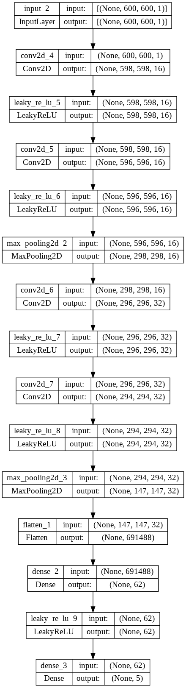
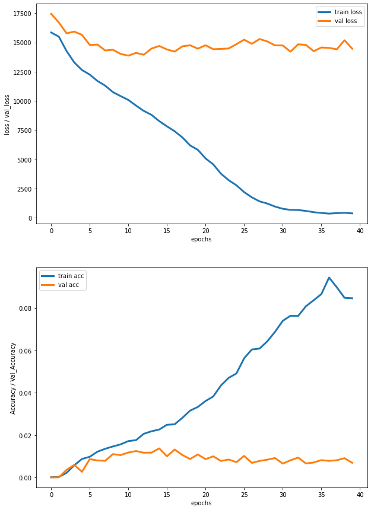

# ML-Group-Project-8: Pothole Detection on the Jetson Nano

## Data Preprocessing

* Our dataset consists of 2236 pairs of images. Each image is either 630 by 1024 or 640 by 1024.
In order to standardize, we scale each image down to 600 by 600. This also makes the training easier by decreasing the dimensions we input into our model [1].
* Once the image is loaded into our python environment as a PIL object, we convert to grayscale. This is actually only needed for the original images as they are in color and the pothole masks are already black and white.
* We then normalize the image by turning it into a numpy array and dividing by 255.
* Our result is 2236 image pairs all of which are (600, 600) numpy arrays with float values ranging from 0 to 1.

[1] The main reason is that as long as the rescaling doesn't significantly distort the relevant features of an image, shrinking it down allows us to build a deeper model and train on more examples with the limited compute and time resources we have. We will test it out but most likely we are going to end up shrinking the images even further (to 250 by 250) later on.

## First Model

Our first model is a Convolutional Neural Network with the layers:
 

We thought this was a good place to start because it is not very complicated, and was trainable in a decent amount of time. We used 40 epochs, with a batch size of 2, to speed up training, as it was taking a very long time.

We are using IOU as an accuracy metric for the bounding boxes. Intersection over Union (IOU) is defined as the area of overlap divided by the area of union of the predicted and true bounding boxes. Typically, an IOU > 0.5 is very good. We used a custom defined loss, $MSE + (1 - IOU)$, which we will most likely change in the future. We came up with this to simple incorperate both the MSE and in the training of the model. This is how this simple model performed:
 

As we can see, this model is far too simple to have an IOU (accuracy in the graph) of 0.015 or higher. We can see signs of overfitting after the $14th$ epoch. The model is saved in the files saved_model.pb. 

- EXAMPLE PREDICTIONS
- NEXT MODELS/PREPROCESSING
