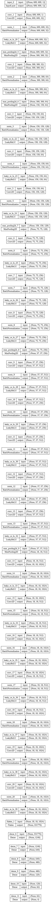
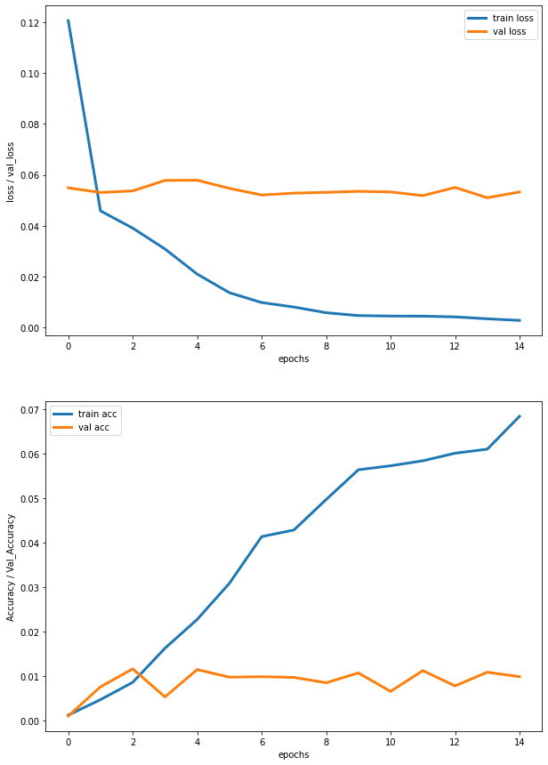

# ML-Group-Project-8: Pothole Detection on the Jetson Nano

## Introduction
With the new era of autonomous vehicles, there is an ever growing necessity for autonomous road safety and road defect detection. Our objective in this project is to develop machine learning models which detect potholes in roads, a small step towards making autonomous driving safer. The data we are currently planning to use comes from the Brazilian National Department of Transport Infrastructure, and consists of 2235 images of highways in the states of Espírito Santo, Rio Grande do Sul and the Federal District from 2014 to 2017. The resolution of the images is at least 1280x729 with a 16:9 aspect ratio. We hope to train deep convolutional neural networks and potentially other machine learning models to consistently identify potholes in new road images, with the end-goal of real time video inference using a Jetson Nano. We will also consider many data preprocessing methods such as image masking/transforming and scaling in our pipeline to further optimize our models. Our hypothesis is that a sufficiently large deep convolutional neural network is capable of accurately classifying road defects, and we hope to optimize its performance with what we have learned in class and previous work in the field.

## Methods

### Data Creation
The first step is to create the dataset with the images, their labels, and the parameters for the pothole bounding boxes. We will use keras to load and convert images to numpy arrays, and cv2 to detect the potholes and label them. We store the dataset as a csv file. This is what a sample/mask looks like with its corresponding bounding box

After creating the csv dataset, it looks like this:

### Data Exploration
We are working with a dataset that contains **2235** samples (images). The target classes are **0** and **1**, which correspond to the given road containing a pothole (**1**) or not (**0**). As we can see in the target class distribution, the data is a bit imbalanced. We have **564** samples with potholes, and **1671** samples without. 

What each of the target classes look like:
 

The distributions of bounding box widths & heights are very right skewed, as one would expect. 

### Data Preprocessing

* Our dataset consists of 2236 pairs of images. Each image is either 630 by 1024 or 640 by 1024.
In order to standardize, we scale each image down to 600 by 600. This also makes the training easier by decreasing the dimensions we input into our model [1].
* Once the image is loaded into our python environment as a PIL object, we convert to grayscale. This is actually only needed for the original images as they are in color and the pothole masks are already black and white.
* We then normalize the image by turning it into a numpy array and dividing by 255.
* Our result is 2236 image pairs all of which are (600, 600) numpy arrays with float values ranging from 0 to 1.

[1] The main reason is that as long as the rescaling doesn't significantly distort the relevant features of an image, shrinking it down allows us to build a deeper model and train on more examples with the limited compute and time resources we have. We will test it out but most likely we are going to end up shrinking the images even further (to 250 by 250) later on.

## Model 1

Our first model is a Convolutional Neural Network with the layers:
 

This simple model has **4** convolutional layers and **1** Dense layer with 62 nodes. We used 15 epochs, with a batch size of 2, and the Adam optimizer with a learning rate of **0.0001**.

## Model 2

Our second model is similar to the original yolo v1 object detection CNN, with the layers:
 

We are using IOU as an accuracy metric for the bounding boxes. Intersection over Union (IOU) is defined as the area of overlap divided by the area of union of the predicted and true bounding boxes. Typically, an IOU > 0.5 is very good. We used a custom defined loss, $MSE + (1 - IOU)$, which we will most likely change in the future. We came up with this to simple incorperate both the MSE and in the training of the model. This is how this simple model performed:
 

We thought this was a good place to start because it is not very complicated, and was trainable in a decent amount of time.

As we can see, this model is far too simple to have an IOU (accuracy in the graph) of 0.015 or higher. We can see signs of overfitting after the $14th$ epoch. The model is saved in the files saved_model.pb. 

We can see this simple model did not perform very well, but there is lots of room for improvement. Here is an example prediction (green: true, red:prediction):
 

